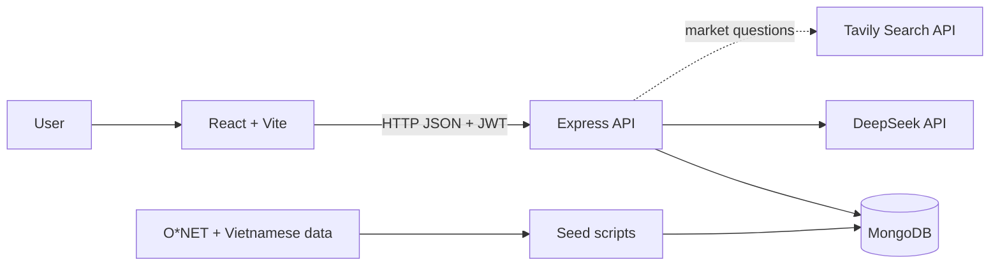

# Báo Cáo Tóm Tắt Dự Án

## AI Career Platform

**Mục tiêu tài liệu:** cung cấp đủ ngữ cảnh về dự án 
**Phạm vi:** mã nguồn hiện có trong repo `ai-career-platform`.

---

## 1. Tổng Quan

AI Career Platform là nền tảng web hỗ trợ học sinh THPT khám phá bản thân và tham khảo định hướng nghề nghiệp bằng cách kết hợp dữ liệu có cấu trúc với AI.

Hệ thống không để AI tự sinh danh sách nghề một cách tự do. Thay vào đó, học sinh tạo hồ sơ từ nhiều nguồn:

- Thông tin cá nhân và học tập cơ bản.
- Bài test RIASEC để xác định nhóm sở thích nghề nghiệp.
- Core Quiz để thu thập bằng chứng về năng lực, phong cách làm việc, kỹ năng và kiến thức.
- AI Discovery để khai thác thêm trải nghiệm thực tế qua hội thoại, sau đó học sinh tự xác nhận các yếu tố phù hợp.

Sau khi có hồ sơ, backend tính điểm các yếu tố của học sinh, so khớp với dữ liệu nghề nghiệp và trả về tối đa 15 nghề phù hợp. AI được dùng ở các phần cần hội thoại hoặc diễn giải: gợi mở AI Discovery, giải thích vì sao một nghề phù hợp, mô tả “một ngày làm việc”, và Career Explore Chat để hỏi sâu hơn về từng nghề.

---

## 2. Bài Toán Và Mục Tiêu

### Bài toán

Học sinh THPT thường gặp khó khăn khi chọn ngành/nghề vì:

- Chưa hiểu rõ sở thích, năng lực và phong cách làm việc của bản thân.
- Thông tin nghề nghiệp phân tán, khó liên hệ với điểm mạnh cá nhân.
- Một bài trắc nghiệm đơn lẻ chưa đủ phản ánh trải nghiệm thực tế.
- Gợi ý nghề dạng danh sách thường thiếu lý do cụ thể và khó kiểm chứng.

### Mục tiêu hệ thống

- Tạo quy trình khám phá bản thân theo nhiều bước.
- Chuẩn hóa hồ sơ học sinh thành các yếu tố có thể tính điểm.
- So khớp hồ sơ với dữ liệu nghề nghiệp bằng thuật toán rõ ràng.
- Dùng AI để đặt câu hỏi, diễn giải và hỗ trợ tra cứu, không dùng AI làm nguồn quyết định duy nhất.
- Có luồng quản trị để kiểm duyệt dữ liệu nghề và Core Quiz.

### Người dùng

- **Học sinh:** làm test, trò chuyện với AI, xem hồ sơ, nhận gợi ý nghề, hỏi sâu về từng nghề.
- **Admin:** quản lý career, Core Quiz, tra cứu element chuẩn và kiểm duyệt mapping điểm.

---

## 3. Luồng Chức Năng Chính

Frontend tổ chức hành trình học sinh tại route `/discovery` với 5 bước:

1. `RIASEC`: làm bài test sở thích nghề nghiệp Holland.
2. `Core Quiz`: trả lời câu hỏi để tạo bằng chứng định lượng cho các yếu tố hồ sơ.
3. `AI Discovery`: trò chuyện với AI để phát hiện thêm điểm mạnh từ trải nghiệm thực tế.
4. `Dashboard`: xem radar chart RIASEC và Top 10 yếu tố có `finalScore` cao nhất.
5. `Recommendations`: xem tối đa 15 nghề phù hợp.

`DiscoveryWorkflowLayout` hiển thị stepper và tính tiến độ từ dữ liệu thật trong hồ sơ: `riasecCompletedAt`, `coreQuizCompletedAt`, `aiDiscoveries`, `elementScores`.

---

## 4. Các Module Nghiệp Vụ

### 4.1. Xác thực và phân quyền

- Đăng ký, đăng nhập bằng email và mật khẩu.
- Mật khẩu mã hóa bằng `bcryptjs`.
- Xác thực bằng access token JWT, mặc định hết hạn sau 15 phút.
- Refresh token là chuỗi ngẫu nhiên, được hash trước khi lưu vào `User.refreshTokenHash`, mặc định hết hạn sau 30 ngày.
- Frontend tự gọi `/api/auth/refresh` khi gặp lỗi 401 và có refresh token trong `localStorage`.
- Vai trò: `student`, `admin`.
- Đăng ký công khai luôn tạo tài khoản `student`; admin được tạo qua `/api/auth/admin/create` với `ADMIN_SETUP_SECRET`.
- Backend dùng middleware `protect` và `adminOnly` để bảo vệ API riêng tư và API quản trị.

### 4.2. Hồ sơ học sinh

Model `StudentProfile` lưu:

- Khối lớp 10, 11 hoặc 12.
- Môn yêu thích, môn học tốt, mục tiêu cá nhân.
- Mã và điểm RIASEC.
- Câu trả lời Core Quiz.
- Các yếu tố học sinh xác nhận từ AI Discovery.
- `elementScores`: điểm tổng hợp theo từng yếu tố.
- Snapshot gợi ý nghề.
- Cache nội dung AI cho giải thích nghề và “một ngày làm việc”.

### 4.3. RIASEC

RIASEC gồm 6 nhóm Holland:

| Mã | Nhóm | Ý nghĩa |
|---|---|---|
| R | Realistic | Thực tế, thao tác, kỹ thuật |
| I | Investigative | Nghiên cứu, phân tích |
| A | Artistic | Sáng tạo, biểu đạt |
| S | Social | Hỗ trợ, giảng dạy, tương tác |
| E | Enterprising | Thuyết phục, lãnh đạo, kinh doanh |
| C | Conventional | Tổ chức, quy trình, dữ liệu |

Hệ thống hiện có 30 câu RIASEC. Kết quả được lưu thành mã nổi bật và điểm của 6 nhóm, đồng thời dùng làm ngữ cảnh để chọn yếu tố và câu hỏi mở đầu trong AI Discovery.

### 4.4. Core Quiz

Core Quiz là ngân hàng câu hỏi khám phá bản thân. Hiện có 81 câu, mỗi lượt chọn ngẫu nhiên 30 câu theo quota:

| Nhóm yếu tố | Câu trong ngân hàng | Câu mỗi lượt |
|---|---:|---:|
| `ability` | 21 | 9 |
| `workstyle` | 15 | 7 |
| `transferable_skill` | 15 | 6 |
| `knowledge` | 20 | 5 |
| `essential_skill` | 10 | 3 |
| **Tổng** | **81** | **30** |

Mỗi đáp án ánh xạ tới một hoặc nhiều yếu tố cùng điểm bằng chứng. Học sinh không thấy mapping chi tiết; admin có thể xem và sửa để kiểm duyệt chất lượng câu hỏi.

### 4.5. AI Discovery

AI Discovery là hội thoại có kiểm soát:

- Học sinh phải hoàn thành RIASEC trước.
- Backend chọn tập yếu tố liên quan đến top RIASEC thay vì gửi toàn bộ danh mục vào prompt.
- AI hỏi tiếp dựa trên câu trả lời của học sinh.
- AI đề xuất 3-6 yếu tố tiềm năng, kèm lý do và độ tin cậy.
- Học sinh tự chọn yếu tố phù hợp và xác nhận mức độ 1-3.
- Chỉ các yếu tố đã được học sinh xác nhận mới tham gia tính điểm gợi ý nghề.

Cơ chế kiểm soát AI:

- Chỉ chấp nhận yếu tố có trong database.
- Không tin trực tiếp `code`, `type`, `name` do AI trả về; backend lấy lại từ dữ liệu chuẩn.
- Giới hạn độ dài tin nhắn và số tin nhắn đưa vào prompt.
- Parse JSON linh hoạt, retry một lần nếu output không hợp lệ.
- Xác nhận idempotent để tránh lưu trùng khi request lặp lại.

### 4.6. Danh mục và chi tiết nghề

Người dùng có thể:

- Xem danh sách nghề.
- Tìm theo tên tiếng Việt, tên tiếng Anh, alias hoặc mô tả.
- Lọc theo nhóm nghề.
- Xem chi tiết nghề: mã O*NET, mô tả, nhóm nghề, mã RIASEC và các yếu tố quan trọng.

### 4.7. Gợi ý nghề cá nhân hóa

Endpoint `/api/careers/recommendations/me`:

- Lấy `StudentProfile.elementScores`.
- Nếu điểm hồ sơ dùng phiên bản thuật toán cũ, backend tính lại.
- So khớp hồ sơ với các nghề đang active, phù hợp học sinh và có dữ liệu yếu tố.
- Trả tối đa 15 nghề.
- Cache snapshot theo `algorithmVersion`, fingerprint điểm hồ sơ và fingerprint dữ liệu nghề.

Frontend hiển thị:

- Match percentage.
- Số yếu tố trùng khớp.
- Các yếu tố nổi bật.
- Donut chart phân bố tối đa 15 nghề theo `careerCluster`.

### 4.8. Giải thích nghề bằng AI

Trong trang chi tiết nghề:

- Backend chọn các yếu tố mạnh nhất có đóng góp vào độ phù hợp.
- AI giải thích vì sao điểm mạnh đó liên quan đến nghề.
- AI tạo 5-7 hoạt động trong một ngày làm việc điển hình.
- Kết quả được cache theo nghề, fingerprint hồ sơ và `careerUpdatedAt`.
- Frontend dùng grouped bar chart để so sánh `StudentProfile.elementScores.finalScore` với `Career.elements.importance`.
- Phần “một ngày làm việc” được hiển thị bằng React Flow (`@xyflow/react`) thay vì danh sách thuần.

### 4.9. Career Explore Chat

Career Explore Chat là trang hội thoại riêng tại `/careers/:id/explore-chat`.

Chatbot nhận ngữ cảnh nghề đang xem và các điểm nổi bật trong hồ sơ học sinh. Nó trả lời về công việc thực tế, kỹ năng, môi trường làm việc, lộ trình học tập và mức độ liên hệ với hồ sơ.

Khi câu hỏi liên quan đến lương, tuyển dụng, nhu cầu thị trường hoặc xu hướng việc làm, backend có thể gọi Tavily Search nếu đã cấu hình `TAVILY_API_KEY`, ưu tiên nguồn tại Việt Nam. Nếu chưa cấu hình Tavily, chatbot vẫn hoạt động nhưng frontend thông báo rằng câu trả lời chưa dùng dữ liệu web cập nhật.

Lịch sử Career Explore Chat được lưu trong `StudentProfile.careerExploreChatSessions` theo từng nghề và có trang hub `/career-explore-chats` để xem lại các cuộc trò chuyện. Frontend vẫn dùng `localStorage` như lớp cache/khôi phục nhanh theo từng career.

### 4.10. Quản trị

Admin có thể:

- Quản lý dữ liệu career theo schema hiện tại: `onetCode`, `title_en`, `title_vi`, `aliases`, `description_vi`, `careerCluster`, `riasecCode`, `vietnam_relevance`, `is_active`, `student_suitable` và `elements`.
- Xem danh sách career dành riêng cho admin, bao gồm cả career inactive hoặc không ưu tiên học sinh; có tìm kiếm theo tên, mã O*NET, alias, nhóm nghề và lọc trạng thái.
- Thêm, sửa, xóa từng career. Trang admin hiện không còn import nhiều nghề bằng JSON để tránh nhập dữ liệu lệch schema.
- Gắn và chỉnh `Career.elements` bằng element picker, mỗi dòng gồm `code`, `type` và `importance` từ 0 đến 1.
- Xem và sửa Core Quiz: thông tin câu hỏi, trạng thái active, target elements, đáp án, mapping điểm và độ mạnh bằng chứng.
- Tìm kiếm yếu tố theo nhóm để kiểm duyệt target element và mapping đáp án.

---

## 5. Kiến Trúc Và Công Nghệ

### Mô hình tổng thể



### Công nghệ chính

| Thành phần | Công nghệ |
|---|---|
| Frontend | React 19, React Router, Axios, Vite |
| Visualization | Component chart tự xây dựng, `@xyflow/react` |
| Backend | Node.js, Express 5 |
| Database | MongoDB, Mongoose |
| Auth | JWT, bcryptjs |
| AI client | OpenAI SDK với `baseURL` DeepSeek |
| Web search tùy chọn | Tavily Search API |
| Data processing | ExcelJS, CSV, JSON, Python notebook/script hỗ trợ |
| Test | Node.js built-in test runner |
| Frontend check | ESLint, Vite production build |

### Cấu trúc thư mục chính

```text
ai-career-platform/
├── backend/
│   ├── src/
│   │   ├── constants/
│   │   ├── controllers/
│   │   ├── middleware/
│   │   ├── models/
│   │   ├── prompts/
│   │   ├── routes/
│   │   ├── scripts/
│   │   ├── services/
│   │   ├── db.js
│   │   └── server.js
│   └── package.json
├── frontend/
│   ├── src/
│   │   ├── api/
│   │   ├── components/
│   │   ├── pages/
│   │   ├── App.jsx
│   │   └── main.jsx
│   └── package.json
├── data/
├── QAprofiling.json
└── BAO_CAO_DU_AN.md
```

---

## 6. Dữ Liệu Và Model Chính

### User

Lưu thông tin tài khoản, mật khẩu đã hash, role, `refreshTokenHash` và `refreshTokenExpiresAt`.

### StudentProfile

Là trung tâm của hồ sơ học sinh. Các trường quan trọng:

- `grade`, `favoriteSubjects`, `strongSubjects`, `goal`.
- `riasecCode`, `riasecScores`, `riasecCompletedAt`.
- `coreQuizAnswers`, `coreQuizCompletedAt`.
- `aiDiscoveries`.
- `elementScores`, `elementScoreVersion`.
- `careerRecommendationSnapshot`.
- `careerFitExplanations`, `careerDayInLifeEntries`.

### Element

Danh mục yếu tố nghề nghiệp dùng chung cho Core Quiz, AI Discovery và dữ liệu nghề. Nhóm yếu tố gồm `ability`, `workstyle`, `transferable_skill`, `knowledge`, `essential_skill`.

### Career

Lưu dữ liệu nghề:

- `onetCode`, `title_en`, `title_vi`, `aliases`.
- `description_vi`, `careerCluster`, `riasecCode`.
- `vietnam_relevance`, `student_suitable`, `is_active`.
- `elements`: danh sách yếu tố nghề cần, mỗi yếu tố có `code`, `type`, `importance`.

### ProfilingQuestion

Lưu Core Quiz: câu hỏi, đáp án, target elements và mapping điểm.

### AiDiscovery

Lưu phiên hội thoại AI Discovery và các yếu tố học sinh đã xác nhận.

---

## 7. Thuật Toán Gợi Ý Nghề

Backend vector hóa hồ sơ học sinh và nghề theo `element code`.

- Hồ sơ học sinh dùng `elementScores.finalScore`.
- Nghề dùng `career.elements.importance`.
- Điểm tương đồng kết hợp:
  - `cosine similarity` với trọng số 0.7.
  - `weighted Jaccard` với trọng số 0.3.
- Chỉ trả nghề có ít nhất một yếu tố trùng khớp.
- Sắp xếp theo `recommendationScore`, sau đó `careerCoverage`, sau đó tên nghề.
- Giới hạn tối đa 15 nghề.

Công thức tổng quát:

```text
score = cosine * 0.7 + weightedJaccard * 0.3
```

Kết quả trả thêm:

- `matchPercentage`.
- `similarityBreakdown`.
- `matchedElementCount`.
- `topMatchedElements`.

Điểm nổi bật: kết quả gợi ý không phải danh sách do AI tự bịa, mà là kết quả từ dữ liệu nghề có cấu trúc và thuật toán có thể giải thích.

---

## 8. API Chính

### Auth

| Method | Endpoint | Mô tả |
|---|---|---|
| `POST` | `/api/auth/register` | Đăng ký |
| `POST` | `/api/auth/login` | Đăng nhập |
| `POST` | `/api/auth/refresh` | Cấp access token và refresh token mới |
| `POST` | `/api/auth/logout` | Xóa refresh token đang dùng |
| `POST` | `/api/auth/admin/create` | Tạo admin bằng setup secret |

### Profile, RIASEC, Core Quiz, AI Discovery

| Method | Endpoint | Mô tả |
|---|---|---|
| `GET` | `/api/profile/me` | Lấy hồ sơ học sinh |
| `PUT` | `/api/profile/me` | Cập nhật hồ sơ |
| `POST` | `/api/riasec/submit` | Nộp bài RIASEC |
| `GET` | `/api/core-quiz/questions` | Lấy bộ câu hỏi Core Quiz |
| `POST` | `/api/core-quiz/submit` | Nộp Core Quiz |
| `DELETE` | `/api/core-quiz/me` | Xóa kết quả Core Quiz để làm lại |
| `POST` | `/api/ai-discovery/start` | Bắt đầu phiên AI Discovery |
| `POST` | `/api/ai-discovery/message` | Gửi tin nhắn AI Discovery |
| `POST` | `/api/ai-discovery/confirm` | Xác nhận yếu tố AI đề xuất |

### Careers

| Method | Endpoint | Mô tả |
|---|---|---|
| `GET` | `/api/careers` | Danh sách nghề, tìm kiếm, lọc, phân trang |
| `GET` | `/api/careers/:id` | Chi tiết nghề |
| `GET` | `/api/careers/recommendations/me` | Gợi ý nghề cá nhân hóa |
| `POST` | `/api/careers/:id/fit-explanation` | AI giải thích mức phù hợp |
| `POST` | `/api/careers/:id/day-in-life` | AI tạo một ngày làm việc |
| `POST` | `/api/careers/:id/explore-chat` | Hỏi đáp sâu về nghề |
| `GET` | `/api/careers/explore-chats/me` | Danh sách phiên Career Explore Chat của học sinh |

### Admin

| Method | Endpoint | Mô tả |
|---|---|---|
| `GET` | `/api/careers/admin` | Danh sách career cho admin, có tìm kiếm, lọc trạng thái và phân trang |
| `GET` | `/api/careers/admin/elements` | Tìm element để gắn vào career |
| `POST` | `/api/careers` | Thêm nghề |
| `PUT` | `/api/careers/:id` | Sửa nghề |
| `DELETE` | `/api/careers/:id` | Xóa nghề |
| `GET` | `/api/admin/core-quiz/questions` | Danh sách Core Quiz |
| `PUT` | `/api/admin/core-quiz/questions/:id` | Cập nhật câu hỏi |
| `GET` | `/api/admin/core-quiz/elements` | Tìm yếu tố |

---

## 9. Cài Đặt Và Chạy

### Yêu cầu

- Node.js và npm.
- MongoDB.
- DeepSeek API key nếu dùng tính năng AI.
- Tavily API key nếu muốn Career Explore Chat dùng nguồn web cập nhật.

### Biến môi trường backend

Tạo `backend/.env`:

```env
PORT=5000
MONGO_URI=<mongodb-connection-string>
JWT_SECRET=<jwt-secret>
ADMIN_SETUP_SECRET=<admin-setup-secret>
ACCESS_TOKEN_EXPIRES_IN=15m
REFRESH_TOKEN_TTL_DAYS=30
DEEPSEEK_API_KEY=<deepseek-api-key>
DEEPSEEK_MODEL=<model-name>
TAVILY_API_KEY=<tavily-api-key>
```

`ACCESS_TOKEN_EXPIRES_IN`, `REFRESH_TOKEN_TTL_DAYS`, `DEEPSEEK_MODEL` và `TAVILY_API_KEY` có thể bỏ qua tùy cấu hình. Nếu thiếu Tavily, Career Explore Chat vẫn trả lời nhưng không có dữ liệu web cập nhật. `ADMIN_SETUP_SECRET` cần có nếu muốn dùng endpoint tạo admin.

### Cài dependency

```powershell
cd backend
npm install

cd ..\frontend
npm install
```

### Seed dữ liệu

Chạy trong `backend`:

```powershell
npm run seed:elements
npm run seed:careers
npm run seed:profiling
```

Các lệnh liên quan:

```powershell
npm run seed:careers:dry-run
npm run migrate:optimized-schemas
```

### Chạy ứng dụng

Backend:

```powershell
cd backend
npm run dev
```

Frontend:

```powershell
cd frontend
npm run dev
```

Frontend gọi backend tại `http://localhost:5000/api`.

---

## 10. Kiểm Thử Và Trạng Thái Kỹ Thuật

Theo kiểm tra hiện tại:

| Hạng mục | Lệnh | Trạng thái |
|---|---|---|
| Backend unit test | `npm test` trong `backend` | Đạt: 22/22 test |
| Frontend lint | `npm run lint` trong `frontend` | Chưa đạt toàn repo: còn 2 lỗi `react-hooks/set-state-in-effect` sẵn có ở `frontend/src/pages/CareerExploreChats.jsx` |
| Frontend build | `npm run build` trong `frontend` | Đạt, còn cảnh báo bundle JS > 500 kB |
| Career seed dry-run | `npm run seed:careers:dry-run` trong `backend` | Đạt: chuẩn bị 1016 career, 109161 element weights; 923 career có elements |

Unit test tập trung vào:

- Thuật toán tương đồng và xếp hạng nghề.
- Giới hạn số lượng nghề gợi ý.
- Fingerprint điểm hồ sơ.
- Parser và cache giải thích nghề.
- Parser và cache “một ngày làm việc”.
- Chuẩn hóa lịch sử Career Explore Chat.
- Nhận diện câu hỏi cần tìm kiếm thị trường Việt Nam.
- Parser JSON AI output trong nhiều định dạng.

---

## 11. Điểm Nổi Bật Khi Giải Thích Dự Án

- AI không quyết định thay người dùng; AI chỉ hỗ trợ hỏi, gợi ý yếu tố, diễn giải và tra cứu.
- Gợi ý nghề dựa trên dữ liệu nghề có cấu trúc và thuật toán minh bạch.
- Học sinh phải tự xác nhận yếu tố từ AI Discovery trước khi yếu tố đó tham gia tính điểm.
- Hệ thống có cache theo fingerprint để tránh tính lại hoặc gọi AI lại khi dữ liệu chưa đổi.
- Dữ liệu nghề được chuẩn bị từ O*NET và dữ liệu đã Việt hóa qua seed script.
- Frontend có dashboard và biểu đồ để giải thích kết quả thay vì chỉ hiển thị danh sách.
- Career Explore Chat có thể dùng Tavily Search cho câu hỏi thị trường Việt Nam khi cần dữ liệu cập nhật.

---

## 12. Hạn Chế Hiện Tại

- Frontend đang cấu hình backend URL cố định `http://localhost:5000/api`, chưa tách theo môi trường deploy.
- Endpoint tạo admin đang dùng setup secret và rate limit; trước production cần quản lý secret chặt hơn, ghi log thao tác quản trị và có quy trình cấp quyền rõ ràng.
- Phân quyền frontend chủ yếu phục vụ hiển thị; backend mới là lớp bảo vệ thật.
- Unit test chưa bao phủ toàn bộ API, MongoDB integration và end-to-end flow.
- Tính năng AI phụ thuộc DeepSeek API, kết nối mạng và chi phí gọi model.
- Tìm kiếm thị trường phụ thuộc Tavily API.
- Career Explore Chat đã lưu session ở backend nhưng chưa có giao diện quản lý/xóa từng phiên rõ ràng và chưa có đồng bộ thời gian thực giữa nhiều thiết bị.
- Chưa có dashboard phản hồi người dùng để đo chất lượng gợi ý nghề.
- Cần kiểm tra hiển thị tiếng Việt và dữ liệu demo trước khi báo cáo/deploy.

---

## 13. Hướng Phát Triển

- Tách cấu hình frontend sang biến môi trường.
- Bổ sung Docker và tài liệu deploy.
- Mở rộng validation schema cho API quản trị career và bổ sung rate limit/audit log cho các thao tác admin nhạy cảm.
- Viết integration test cho API và end-to-end test cho luồng học sinh.
- Thêm feedback về gợi ý nghề: hữu ích, không phù hợp, nghề quan tâm.
- Đo chất lượng gợi ý từ phản hồi thật để tinh chỉnh trọng số.
- Hoàn thiện quản lý lịch sử Career Explore Chat: xóa/đổi tên phiên, đồng bộ tốt hơn giữa thiết bị và bổ sung thống kê chất lượng hội thoại.
- Mở rộng dữ liệu lộ trình học tập, ngành đào tạo và trường phù hợp.

---

## 14. Tóm Tắt Một Đoạn

AI Career Platform là hệ thống định hướng nghề nghiệp cho học sinh THPT, kết hợp RIASEC, Core Quiz, AI Discovery và dữ liệu nghề có cấu trúc. Hồ sơ học sinh được chuyển thành điểm các yếu tố như năng lực, phong cách làm việc, kỹ năng và kiến thức; sau đó được so khớp với yêu cầu nghề bằng thuật toán kết hợp cosine similarity và weighted Jaccard. AI được dùng để hội thoại, khai thác thêm bằng chứng, giải thích mức độ phù hợp, mô tả một ngày làm việc và hỗ trợ hỏi sâu về nghề; còn danh sách nghề gợi ý vẫn dựa trên dữ liệu và thuật toán kiểm soát được. Hệ thống gồm React/Vite frontend, Express/MongoDB backend, JWT auth, seed pipeline từ dữ liệu O*NET/Việt hóa, các trang quản trị dữ liệu, dashboard trực quan hóa kết quả và các cơ chế cache/validate để giảm chi phí và hạn chế lỗi AI output.
