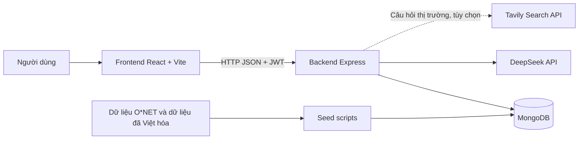
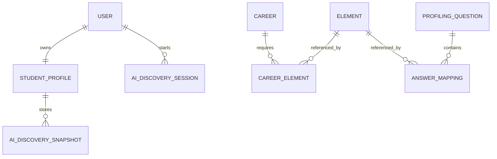
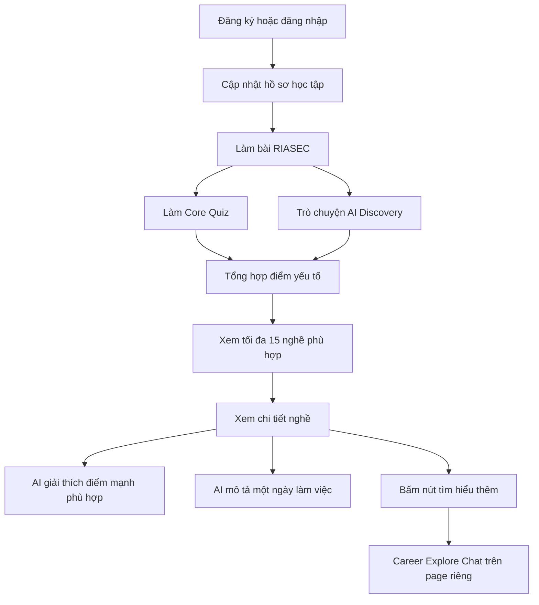
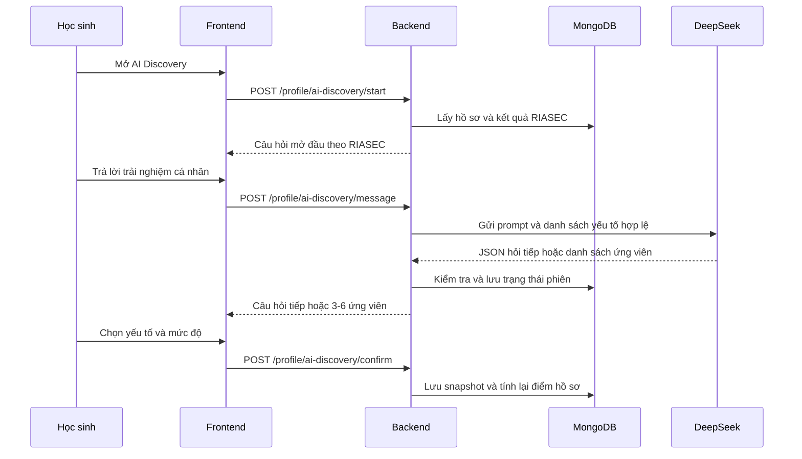
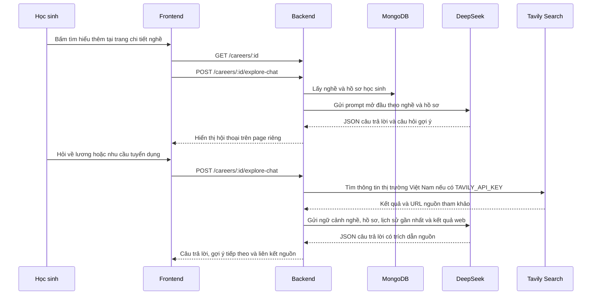

# BÁO CÁO TỔNG QUAN DỰ ÁN

## AI Career Platform - Nền tảng hỗ trợ định hướng nghề nghiệp cho học sinh bằng AI

**Thời điểm tổng hợp:** 01/06/2026  
**Phạm vi tài liệu:** Toàn bộ mã nguồn hiện có trong dự án  
**Đối tượng sử dụng:** Sinh viên trình bày đồ án, giảng viên hướng dẫn, người tiếp nhận dự án

---

## 1. Tóm tắt dự án

AI Career Platform là nền tảng web hỗ trợ học sinh THPT khám phá bản thân và tham khảo định hướng nghề nghiệp. Hệ thống không đưa ra gợi ý chỉ dựa trên một bài trắc nghiệm duy nhất. Thay vào đó, hồ sơ học sinh được xây dựng từ nhiều nguồn:

1. Thông tin cá nhân và học tập cơ bản.
2. Bài trắc nghiệm sở thích nghề nghiệp RIASEC.
3. Core Quiz để nhận diện năng lực, phong cách làm việc, kỹ năng và kiến thức.
4. AI Discovery: hội thoại với AI để khai thác thêm trải nghiệm và điểm mạnh mà bài trắc nghiệm đóng khó thể hiện đầy đủ.

Sau khi tổng hợp hồ sơ, hệ thống so khớp đặc điểm của học sinh với yêu cầu của từng nghề và trả về tối đa 15 nghề phù hợp. Với từng nghề, AI còn hỗ trợ giải thích vì sao nghề đó phù hợp, mô tả một ngày làm việc điển hình và tiếp tục trao đổi sâu hơn qua Career Explore Chat. Khi học sinh hỏi về mức lương, nhu cầu tuyển dụng hoặc xu hướng việc làm, chatbot có thể dùng nguồn tìm kiếm web để bổ sung thông tin thị trường Việt Nam cập nhật.

### Thông điệp giới thiệu ngắn

> Đây là nền tảng định hướng nghề nghiệp cho học sinh THPT theo hướng kết hợp dữ liệu và AI. Hệ thống dùng RIASEC để xác định nhóm sở thích, dùng Core Quiz và hội thoại AI để xây dựng hồ sơ năng lực chi tiết, sau đó so khớp hồ sơ với dữ liệu nghề nghiệp để đưa ra danh sách gợi ý có thể giải thích. Học sinh còn có thể tiếp tục hỏi sâu về từng nghề và tra cứu thông tin thị trường Việt Nam qua Career Explore Chat.

---

## 2. Bài toán và mục tiêu

### 2.1. Bài toán

Học sinh THPT thường gặp khó khăn khi chọn ngành hoặc nghề vì:

- Chưa hiểu rõ sở thích, năng lực và phong cách làm việc của bản thân.
- Thông tin nghề nghiệp phân tán, khó liên hệ với đặc điểm cá nhân.
- Một bài trắc nghiệm đơn lẻ có thể chưa phản ánh đầy đủ trải nghiệm thực tế.
- Các gợi ý dạng danh sách thường thiếu lý do cụ thể, khiến học sinh khó đánh giá.

### 2.2. Mục tiêu

Hệ thống được xây dựng để:

- Cung cấp quy trình khám phá bản thân theo nhiều bước.
- Chuẩn hóa hồ sơ cá nhân thành các yếu tố có thể tính điểm.
- So khớp hồ sơ học sinh với dữ liệu nghề nghiệp bằng thuật toán rõ ràng.
- Dùng AI ở các bước cần diễn giải hoặc khai thác ngữ cảnh tự nhiên.
- Cho phép quản trị viên kiểm duyệt dữ liệu nghề và bộ câu hỏi.

### 2.3. Đối tượng sử dụng

- **Học sinh:** làm bài test, trò chuyện với AI, xem hồ sơ và nhận gợi ý nghề.
- **Quản trị viên:** quản lý danh mục nghề và kiểm duyệt Core Quiz.

---

## 3. Chức năng đã triển khai

### 3.1. Xác thực và phân quyền

- Đăng ký tài khoản.
- Đăng nhập bằng email và mật khẩu.
- Mã hóa mật khẩu bằng `bcryptjs`.
- Xác thực bằng JWT, token có thời hạn 7 ngày.
- Hai vai trò: `student` và `admin`.
- Middleware bảo vệ API riêng tư và API quản trị.

### 3.2. Hồ sơ học sinh

Học sinh có thể lưu:

- Khối lớp: 10, 11 hoặc 12.
- Môn học yêu thích.
- Môn học học tốt.
- Mục tiêu cá nhân.
- Kết quả RIASEC.
- Kết quả Core Quiz.
- Các yếu tố đã xác nhận từ AI Discovery.
- Snapshot điểm tổng hợp và danh sách nghề gợi ý.

### 3.3. Bài test RIASEC

RIASEC là mô hình Holland gồm sáu nhóm sở thích nghề nghiệp:

| Mã | Nhóm | Ý nghĩa ngắn |
|---|---|---|
| R | Realistic | Thực tế, thao tác, kỹ thuật |
| I | Investigative | Nghiên cứu, phân tích, khám phá |
| A | Artistic | Sáng tạo, biểu đạt |
| S | Social | Hỗ trợ, giảng dạy, tương tác con người |
| E | Enterprising | Thuyết phục, lãnh đạo, kinh doanh |
| C | Conventional | Tổ chức, quy trình, dữ liệu |

Hệ thống hiện có 30 câu hỏi RIASEC. Kết quả được lưu dưới dạng mã nổi bật và điểm của cả sáu nhóm. Kết quả này được dùng làm đầu vào cho bước AI Discovery.

### 3.4. Core Quiz

Core Quiz là bộ câu hỏi khám phá bản thân chi tiết hơn RIASEC. Ngân hàng hiện có 81 câu hỏi và mỗi lượt làm bài chọn ngẫu nhiên 30 câu theo hạn mức:

| Nhóm yếu tố | Số câu trong ngân hàng | Số câu mỗi lượt |
|---|---:|---:|
| `ability` | 21 | 9 |
| `workstyle` | 15 | 7 |
| `transferable_skill` | 15 | 6 |
| `knowledge` | 20 | 5 |
| `essential_skill` | 10 | 3 |
| **Tổng** | **81** | **30** |

Mỗi đáp án được ánh xạ tới một hoặc nhiều yếu tố cùng mức điểm bằng chứng. Hệ thống:

- Không gửi mapping điểm chi tiết cho học sinh.
- Cho phép admin xem chi tiết điểm để kiểm duyệt.
- Kiểm tra `questionId` và chỉ số đáp án khi nộp bài.
- Có thể xóa kết quả Core Quiz và làm lại.
- Giữ nguyên bằng chứng từ AI Discovery khi reset Core Quiz.

### 3.5. AI Discovery

AI Discovery là luồng hội thoại nhằm khai thác điểm mạnh từ trải nghiệm thực tế của học sinh:

1. Học sinh cần hoàn thành RIASEC trước.
2. Hệ thống chọn tập yếu tố phù hợp với ba ký tự RIASEC nổi bật.
3. Hệ thống mở đầu bằng câu hỏi phù hợp với nhóm RIASEC chính.
4. AI hỏi tiếp dựa trên câu trả lời của học sinh.
5. AI đề xuất từ 3 đến 6 yếu tố tiềm năng, kèm lý do và độ tin cậy.
6. Học sinh chọn yếu tố phù hợp và tự xác nhận mức độ từ 1 đến 3.
7. Các yếu tố đã xác nhận được lưu vào hồ sơ và tham gia tính điểm gợi ý nghề.

AI Discovery có các cơ chế kiểm soát:

- Chỉ chấp nhận yếu tố đã có trong cơ sở dữ liệu.
- Không tin trực tiếp `code`, `type`, `name` do AI trả về.
- Giới hạn độ dài tin nhắn.
- Chỉ lưu tối đa 50 tin nhắn trong phiên.
- Chỉ gửi tối đa 20 tin nhắn gần nhất vào prompt để kiểm soát chi phí và kích thước ngữ cảnh.
- Retry một lần nếu AI trả JSON không hợp lệ.
- Xác nhận kết quả theo hướng idempotent, tránh lưu trùng khi request lặp lại.

### 3.6. Danh mục và chi tiết nghề nghiệp

Người dùng có thể:

- Xem danh sách nghề.
- Tìm kiếm theo tên tiếng Việt, tên tiếng Anh, tên thay thế hoặc mô tả.
- Lọc theo nhóm nghề.
- Phân trang.
- Xem chi tiết nghề: mã O*NET, mô tả, nhóm nghề, mã RIASEC và các yếu tố quan trọng.

### 3.7. Gợi ý nghề nghiệp cá nhân hóa

Sau khi hồ sơ có đủ bằng chứng, hệ thống:

- Tổng hợp điểm yếu tố của học sinh.
- So khớp với trọng số yếu tố của từng nghề.
- Xếp hạng và trả tối đa 15 nghề phù hợp.
- Hiển thị phần trăm phù hợp, số yếu tố trùng khớp và các yếu tố nổi bật.
- Cache kết quả để tránh tính lại khi hồ sơ và dữ liệu nghề không thay đổi.

Bo sung truc quan hoa Match Analytics:

- Dashboard tong ket truoc khi xem nghe gom radar RIASEC va Top 10 element co `finalScore` cao nhat.
- Trang danh sach goi y co donut chart thong ke 15 nghe theo `careerCluster`, giup hoc sinh nhin ra xu huong nhom nganh phu hop.
- Trang chi tiet nghe co grouped bar chart so sanh vector ho so hoc sinh (`StudentProfile.elementScores.finalScore`) voi yeu cau nghe (`Career.elements.importance`).
- Cot doi gom "Muc do ban co" va "Muc do nghe can", giup giai thich ro vi sao thuat toan xep hang nghe do va dau la khoang cach can cai thien.

### 3.8. Giải thích nghề nghiệp bằng AI

Trong trang chi tiết nghề, hệ thống dùng AI để:

- Giải thích vì sao một điểm mạnh của học sinh phù hợp với nghề.
- Mô tả từ 5 đến 7 hoạt động trong một ngày làm việc điển hình.
- Cache kết quả theo phiên bản hồ sơ và thời điểm cập nhật nghề.
- Cho phép tạo lại nội dung khi cần.

### 3.9. Career Explore Chat

Sau khi xem chi tiết một nghề, học sinh có thể bấm nút **Tìm hiểu thêm với Career Explore Chat** để chuyển sang trang hội thoại riêng. Việc tách page giúp trang chi tiết nghề không bị quá tải nội dung.

Chatbot:

- Nhận ngữ cảnh nghề đang xem và các điểm nổi bật trong hồ sơ học sinh.
- Mở đầu bằng phần giới thiệu ngắn và các câu hỏi gợi ý có thể bấm nhanh.
- Trả lời câu hỏi về công việc thực tế, kỹ năng, môi trường làm việc, lộ trình học tập và mức độ liên hệ với hồ sơ.
- Chỉ gửi tối đa 10 tin nhắn gần nhất vào prompt và giới hạn mỗi tin nhắn ở 1.200 ký tự.
- Tự nhận diện câu hỏi cần dữ liệu thị trường như lương, thu nhập, tuyển dụng, việc làm, nhu cầu hoặc xu hướng.
- Gọi Tavily Search khi đã cấu hình `TAVILY_API_KEY`, ưu tiên kết quả tại Việt Nam và hiển thị liên kết nguồn tham khảo.
- Vẫn hoạt động bằng kiến thức model nếu chưa cấu hình Tavily; giao diện thông báo rõ rằng câu trả lời chưa dùng dữ liệu thị trường cập nhật.
- Không tin chỉ dẫn xuất hiện trong nội dung web và không cho phép AI bịa số liệu khi không có nguồn hỗ trợ.

Backend có cơ chế xử lý output AI không ổn định:

- Parse JSON thuần hoặc JSON nằm trong markdown code fence.
- Có thể trích JSON nếu model thêm nội dung thừa trước hoặc sau object.
- Retry DeepSeek đúng một lần nếu JSON vẫn không hợp lệ.
- Log stage lỗi và preview response giới hạn 500 ký tự để hỗ trợ debug mà không ghi toàn bộ prompt hoặc hồ sơ học sinh.

### 3.10. Chức năng quản trị

Admin có thể:

- Thêm, sửa, xóa nghề nghiệp.
- Thêm nhiều nghề bằng JSON.
- Xem và sửa Core Quiz.
- Tìm kiếm yếu tố theo nhóm.
- Kiểm duyệt target element, mapping đáp án và điểm số.

---

## 4. Kiến trúc hệ thống

### 4.1. Mô hình tổng thể



### 4.2. Công nghệ sử dụng

| Thành phần | Công nghệ |
|---|---|
| Frontend | React 19, React Router, Axios, Vite |
| Backend | Node.js, Express 5 |
| Database | MongoDB, Mongoose |
| Xác thực | JWT, bcryptjs |
| AI client | OpenAI SDK với `baseURL` DeepSeek |
| Web search tùy chọn | Tavily Search API, ưu tiên kết quả Việt Nam |
| Xử lý dữ liệu | ExcelJS, CSV, JSON, Python notebook/script hỗ trợ |
| Kiểm thử | Node.js built-in test runner |
| Kiểm tra frontend | ESLint, Vite production build |

### 4.3. Cấu trúc thư mục chính

```text
ai-career-platform/
├── backend/
│   ├── src/
│   │   ├── constants/      # Hằng số dùng chung
│   │   ├── controllers/    # Xử lý Core Quiz, AI Discovery và Career Explore Chat
│   │   ├── data/           # Dữ liệu nhỏ dùng trực tiếp hoặc phục vụ seed
│   │   ├── middleware/     # JWT và phân quyền admin
│   │   ├── models/         # Mongoose schemas
│   │   ├── prompts/        # Prompt cho DeepSeek
│   │   ├── routes/         # REST API
│   │   ├── scripts/        # Seed và migration
│   │   ├── services/       # Thuật toán và tích hợp AI
│   │   ├── db.js
│   │   └── server.js
│   ├── .env.example       # Cấu hình backend mẫu, gồm DeepSeek và Tavily tùy chọn
│   └── package.json
├── frontend/
│   ├── src/
│   │   ├── api/            # Axios client
│   │   ├── components/
│   │   ├── pages/
│   │   ├── App.jsx
│   │   └── main.jsx
│   └── package.json
├── data/                   # Dữ liệu nguồn nghề nghiệp và file xử lý
├── QAprofiling.json        # Ngân hàng Core Quiz gốc
└── BAO_CAO_DU_AN.md
```

Bo sung cau truc chart frontend:

```text
frontend/src/components/analytics/
├── ProfileRadarChart.jsx     # Bieu do mang nhen RIASEC
├── TopElementsBarChart.jsx   # Top nang luc cot loi cua hoc sinh
├── JobMatchCompareChart.jsx  # Bieu do cot doi so khop Ho so vs Nghe
└── IndustryDonutChart.jsx    # Phan bo 15 nghe theo nhom nganh
```

---

## 5. Thiết kế dữ liệu

### 5.1. Các collection chính

| Collection / Model | Vai trò |
|---|---|
| `User` | Tài khoản, email, mật khẩu đã hash, vai trò |
| `StudentProfile` | Hồ sơ học sinh và dữ liệu tổng hợp phục vụ gợi ý |
| `Career` | Nghề nghiệp, mã O*NET, mô tả, RIASEC và các yếu tố quan trọng |
| `Element` | Danh mục yếu tố chuẩn hóa: năng lực, kỹ năng, kiến thức, phong cách |
| `ProfilingQuestion` | Ngân hàng câu hỏi Core Quiz và mapping điểm |
| `AiDiscoverySession` | Phiên hội thoại AI, ứng viên được trích xuất và kết quả xác nhận |

### 5.2. Năm nhóm yếu tố

| Mã nhóm | Ý nghĩa |
|---|---|
| `ability` | Năng lực |
| `workstyle` | Phong cách làm việc |
| `essential_skill` | Kỹ năng thiết yếu |
| `transferable_skill` | Kỹ năng có thể chuyển đổi |
| `knowledge` | Kiến thức |

### 5.3. Quan hệ dữ liệu khái quát



### 5.4. Dữ liệu nguồn

Dự án có pipeline seed từ dữ liệu O*NET và dữ liệu đã Việt hóa:

- `Occupation_Data_ready.csv`: danh sách nghề.
- `Abilities.xlsx`: năng lực.
- `Essential Skills.xlsx`: kỹ năng thiết yếu.
- `Knowledge.xlsx`: kiến thức.
- `Transferable Skills.xlsx`: kỹ năng có thể chuyển đổi.
- `Work Styles.xlsx`: phong cách làm việc.
- `onet_riasec_mapped.xlsx`: mã Holland/RIASEC theo nghề.
- `elements.csv`: danh sách 141 yếu tố chuẩn hóa.
- `elementRiasecClassifications.json`: ánh xạ RIASEC cho 141 yếu tố.

Kết quả chạy kiểm tra seed nghề ở chế độ dry-run:

| Chỉ số | Giá trị |
|---|---:|
| Tổng số nghề chuẩn bị import | 1.016 |
| Nghề có dữ liệu yếu tố | 923 |
| Nghề chưa có dữ liệu yếu tố | 93 |
| Nghề có mã RIASEC | 923 |
| Tổng trọng số yếu tố theo nghề | 109.161 |
| Yếu tố chuẩn hóa | 141 |

Hệ thống chỉ đưa nghề `is_active`, `student_suitable` và có ít nhất một yếu tố vào thuật toán gợi ý.

---

## 6. Thuật toán xây dựng hồ sơ và gợi ý nghề

### 6.1. Nguồn bằng chứng

Điểm của từng yếu tố được tính từ hai nguồn:

- **Core Quiz:** bằng chứng từ đáp án trắc nghiệm.
- **AI Discovery:** yếu tố do AI đề xuất và học sinh trực tiếp xác nhận.

RIASEC không được đưa trực tiếp vào công thức xếp hạng cuối. Vai trò chính của RIASEC là định hướng bước hội thoại AI và lựa chọn tập yếu tố phù hợp để AI khai thác.

### 6.2. Điểm từ Core Quiz

Với mỗi yếu tố, hệ thống cộng điểm mapping từ các đáp án được chọn và tính trung bình:

```text
averageScore = rawSum / evidenceCount
confidence   = min(evidenceCount / 10 + 0.5, 1)
quizScore    = averageScore * confidence
```

Khi hợp nhất vào hồ sơ tổng, độ tin cậy của Core Quiz còn được điều chỉnh theo số bằng chứng:

```text
quizReliability = min(evidenceCount / 5, 1)
```

### 6.3. Điểm từ AI Discovery

Học sinh tự xác nhận mức độ của yếu tố theo ba cấp:

```text
aiDiscoveryScore = level / 3
```

Độ tin cậy của AI chỉ tinh chỉnh nhẹ trọng số:

```text
aiDiscoveryReliability = 0.8 + 0.2 * aiConfidence
```

Thiết kế này đặt quyết định xác nhận của học sinh cao hơn độ tự tin do AI tự đánh giá.

### 6.4. Hợp nhất điểm hồ sơ

Khi một yếu tố có cả hai nguồn:

```text
quizWeight        = 0.25 * quizReliability
aiDiscoveryWeight = 0.75 * aiDiscoveryReliability

finalScore =
    (quizScore * quizWeight + aiDiscoveryScore * aiDiscoveryWeight)
    / (quizWeight + aiDiscoveryWeight)
```

AI Discovery được ưu tiên vì học sinh đã trực tiếp xác nhận yếu tố sau hội thoại. Core Quiz đóng vai trò bằng chứng nền và đối chiếu.

Khi chỉ có một nguồn:

- Chỉ có AI Discovery: dùng trực tiếp `aiDiscoveryScore`.
- Chỉ có Core Quiz: giảm điểm nếu số bằng chứng còn ít.

### 6.5. So khớp hồ sơ với nghề

Mỗi học sinh và mỗi nghề được biểu diễn thành vector trọng số theo mã yếu tố. Điểm tương đồng:

```text
recommendationScore =
    0.7 * cosineSimilarity
    + 0.3 * weightedJaccard
```

Trong đó:

- **Cosine similarity:** đo độ tương đồng về hướng của hai vector.
- **Weighted Jaccard:** đo mức độ giao nhau có xét trọng số.
- **Career coverage:** dùng thêm để ưu tiên khi cần phân hạng các nghề có điểm gần nhau.

Hệ thống chỉ giữ nghề có ít nhất một yếu tố trùng khớp và trả tối đa 15 kết quả.

### 6.6. Cache và khả năng giải thích

Hệ thống lưu:

- Phiên bản thuật toán điểm hồ sơ.
- Hash SHA-256 của điểm yếu tố.
- Fingerprint của dữ liệu nghề.
- Snapshot gợi ý đã sinh.
- Giải thích AI theo nghề, điểm mạnh và phiên bản hồ sơ.
- Mô tả một ngày làm việc theo nghề và thời điểm cập nhật nghề.

Nhờ đó, kết quả có thể tái sử dụng nếu dữ liệu đầu vào chưa thay đổi, giảm số lần tính toán và gọi AI không cần thiết.

---

## 7. Luồng nghiệp vụ chính

### 7.1. Luồng dành cho học sinh



### 7.2. Luồng AI Discovery



### 7.3. Luồng Career Explore Chat



---

## 8. REST API chính

### 8.1. Xác thực

| Method | Endpoint | Mô tả |
|---|---|---|
| `POST` | `/api/auth/register` | Đăng ký |
| `POST` | `/api/auth/login` | Đăng nhập |
| `GET` | `/api/auth/me` | Lấy thông tin tài khoản hiện tại |

### 8.2. Hồ sơ và khám phá bản thân

| Method | Endpoint | Mô tả |
|---|---|---|
| `GET` | `/api/profile` | Lấy hồ sơ |
| `POST` | `/api/profile` | Tạo hồ sơ |
| `PUT` | `/api/profile` | Cập nhật hồ sơ |
| `PUT` | `/api/profile/riasec` | Lưu kết quả RIASEC |
| `GET` | `/api/riasec/questions` | Lấy câu hỏi RIASEC |
| `GET` | `/api/profile/core-quiz/questions` | Lấy câu hỏi Core Quiz |
| `GET` | `/api/profile/core-quiz/result` | Lấy kết quả Core Quiz đã lưu |
| `POST` | `/api/profile/core-quiz/submit` | Nộp Core Quiz |
| `DELETE` | `/api/profile/core-quiz/result` | Reset Core Quiz |

### 8.3. AI Discovery

| Method | Endpoint | Mô tả |
|---|---|---|
| `POST` | `/api/profile/ai-discovery/start` | Mở hoặc tiếp tục phiên |
| `POST` | `/api/profile/ai-discovery/message` | Gửi tin nhắn |
| `POST` | `/api/profile/ai-discovery/reset` | Tạo phiên mới |
| `POST` | `/api/profile/ai-discovery/confirm` | Xác nhận yếu tố |

### 8.4. Nghề nghiệp

| Method | Endpoint | Mô tả |
|---|---|---|
| `GET` | `/api/careers` | Danh sách nghề, tìm kiếm, lọc, phân trang |
| `GET` | `/api/careers/:id` | Chi tiết nghề |
| `GET` | `/api/careers/recommendations/me` | Gợi ý nghề cá nhân hóa |
| `POST` | `/api/careers/:id/fit-explanation` | AI giải thích mức phù hợp |
| `POST` | `/api/careers/:id/day-in-life` | AI mô tả ngày làm việc |
| `POST` | `/api/careers/:id/explore-chat` | Hỏi đáp sâu hơn về nghề, có thể tìm kiếm thị trường Việt Nam |

### 8.5. Quản trị

| Method | Endpoint | Mô tả |
|---|---|---|
| `POST` | `/api/careers` | Thêm nghề |
| `PUT` | `/api/careers/:id` | Sửa nghề |
| `DELETE` | `/api/careers/:id` | Xóa nghề |
| `GET` | `/api/admin/core-quiz/questions` | Danh sách Core Quiz để kiểm duyệt |
| `PUT` | `/api/admin/core-quiz/questions/:id` | Cập nhật câu hỏi |
| `GET` | `/api/admin/core-quiz/elements` | Tìm yếu tố theo nhóm |

---

## 9. Cài đặt và chạy dự án

### 9.1. Yêu cầu môi trường

- Node.js và npm.
- MongoDB.
- DeepSeek API key nếu dùng chức năng AI.
- Tavily API key nếu muốn Career Explore Chat tìm kiếm dữ liệu thị trường Việt Nam cập nhật.

### 9.2. Biến môi trường backend

Tạo file `backend/.env` với các biến:

```env
PORT=5000
MONGO_URI=<mongodb-connection-string>
JWT_SECRET=<jwt-secret>
DEEPSEEK_API_KEY=<deepseek-api-key>
DEEPSEEK_MODEL=<model-name>
TAVILY_API_KEY=<tavily-api-key>
```

`DEEPSEEK_MODEL` có thể bỏ qua để dùng giá trị mặc định trong mã nguồn. `TAVILY_API_KEY` là tùy chọn: chatbot vẫn hoạt động nếu chưa cấu hình nhưng không dùng kết quả web cập nhật. Dự án có file `backend/.env.example` để tham khảo nhanh.

### 9.3. Cài dependency

```powershell
cd backend
npm install

cd ..\frontend
npm install
```

### 9.4. Khởi tạo dữ liệu

Chạy trong thư mục `backend`:

```powershell
npm run seed:elements
npm run seed:careers
npm run seed:profiling
```

Khi cần cập nhật dữ liệu cũ theo schema tối ưu:

```powershell
npm run migrate:optimized-schemas
```

Có thể kiểm tra dữ liệu nghề mà không ghi MongoDB:

```powershell
npm run seed:careers:dry-run
```

### 9.5. Chạy ứng dụng

Mở hai terminal:

```powershell
cd backend
npm run dev
```

```powershell
cd frontend
npm run dev
```

Frontend gọi backend tại `http://localhost:5000/api`.

---

## 10. Kiểm thử và trạng thái kỹ thuật

Tại thời điểm tổng hợp tài liệu:

| Hạng mục | Lệnh | Kết quả |
|---|---|---|
| Unit test backend | `npm test` trong `backend` | Đạt: 22/22 test |
| Lint frontend | `npm run lint` trong `frontend` | Đạt |
| Build frontend | `npm run build` trong `frontend` | Đạt |
| Dry-run seed nghề | `npm run seed:careers:dry-run` trong `backend` | Đạt |

Unit test hiện tập trung vào:

- Công thức tương đồng và xếp hạng nghề.
- Giới hạn số lượng nghề gợi ý.
- Fingerprint điểm hồ sơ.
- Parser và cache giải thích nghề.
- Parser và cache nội dung một ngày làm việc.
- Chuẩn hóa lịch sử Career Explore Chat.
- Nhận diện câu hỏi cần tìm kiếm thị trường Việt Nam.
- Parser Career Explore Chat: JSON thuần, markdown fence, text thừa và preview khi JSON lỗi.

---

## 11. Điểm nổi bật để trình bày

### 11.1. AI không quyết định thay người dùng

AI chủ yếu làm bốn việc:

- Đặt câu hỏi gợi mở.
- Đề xuất yếu tố tiềm năng để học sinh xác nhận.
- Diễn giải kết quả nghề nghiệp bằng ngôn ngữ tự nhiên.
- Trao đổi sâu hơn về nghề qua Career Explore Chat, có thể kết hợp nguồn web khi cần dữ liệu thị trường cập nhật.

Điểm cuối vẫn dựa trên dữ liệu có cấu trúc và xác nhận của học sinh.

### 11.2. Có khả năng giải thích

Hệ thống lưu score breakdown và hiển thị yếu tố trùng khớp. Gợi ý nghề không phải danh sách được AI sinh tự do mà là kết quả từ thuật toán so khớp.

### 11.3. Có pipeline dữ liệu thực tế

Dữ liệu nghề không nhập thủ công hoàn toàn. Dự án có script:

- Đọc CSV và Excel.
- Chuẩn hóa mã yếu tố.
- Loại dữ liệu không liên quan.
- Chuẩn hóa trọng số về khoảng từ 0 đến 1.
- Ghép nghề với yếu tố và mã RIASEC.
- Upsert vào MongoDB.

### 11.4. Có tối ưu cho vận hành

- Cache kết quả gợi ý theo fingerprint.
- Cache nội dung AI.
- Giới hạn context hội thoại.
- Lưu snapshot để có thể tính lại khi thuật toán thay đổi.
- Validate JSON do AI trả về.
- Retry có kiểm soát khi JSON lỗi.
- Tìm kiếm web theo nhu cầu thay vì gọi cho mọi câu hỏi Career Explore Chat.
- Log stage lỗi Career Explore Chat mà không ghi toàn bộ prompt hoặc hồ sơ học sinh.

---

## 12. Hạn chế hiện tại và hướng phát triển

### 12.1. Hạn chế hiện tại

- Frontend đang cấu hình cố định backend URL là `http://localhost:5000/api`, chưa tách theo môi trường deploy.
- Form đăng ký backend hiện nhận trường `role` từ request. Trước khi triển khai thật cần khóa đăng ký công khai về `student`, chỉ tạo admin bằng cơ chế riêng.
- Phân quyền ở frontend chủ yếu phục vụ hiển thị menu; backend mới là lớp bảo vệ thực sự.
- Unit test chưa bao phủ toàn bộ API, MongoDB integration và end-to-end flow.
- Chức năng AI phụ thuộc DeepSeek API, kết nối mạng và chi phí gọi model.
- Tìm kiếm thị trường cập nhật trong Career Explore Chat phụ thuộc Tavily API. Nếu chưa cấu hình `TAVILY_API_KEY`, chatbot vẫn trả lời nhưng không có nguồn web cập nhật.
- Lịch sử Career Explore Chat hiện chỉ giữ trong phiên frontend, chưa lưu để học sinh tiếp tục hội thoại trên thiết bị hoặc phiên đăng nhập khác.
- Chưa có dashboard thống kê hoặc đánh giá chất lượng gợi ý từ phản hồi người dùng.
- Cần kiểm tra hiển thị tiếng Việt trên toàn bộ giao diện trước buổi demo và trước khi deploy.

### 12.2. Hướng phát triển

- Tách cấu hình frontend thành biến môi trường.
- Bổ sung tài liệu triển khai và Docker.
- Bổ sung refresh token, rate limit, validation schema và cơ chế tạo admin riêng.
- Viết integration test cho API và end-to-end test cho luồng học sinh.
- Thêm feedback: hữu ích, không phù hợp, nghề quan tâm.
- Đo chất lượng gợi ý theo phản hồi thật để điều chỉnh trọng số.
- Bổ sung dashboard quản trị dữ liệu và thống kê sử dụng.
- Mở rộng dữ liệu lộ trình học tập, ngành đào tạo và trường phù hợp.
- Lưu phiên Career Explore Chat và bổ sung rate limit cho endpoint hội thoại.

---

## 13. Kịch bản demo đề xuất

Thời lượng hợp lý: 7 đến 10 phút.

### Bước 1: Giới thiệu bài toán

Nói ngắn:

> Học sinh thường biết tên một số nghề nhưng chưa biết nghề nào phù hợp với điểm mạnh của mình. Dự án này xây dựng hồ sơ cá nhân từ nhiều nguồn rồi so khớp với dữ liệu nghề để đưa ra gợi ý có lý do.

### Bước 2: Đăng nhập và hồ sơ

- Đăng nhập tài khoản học sinh.
- Mở trang hồ sơ.
- Giới thiệu khối lớp, môn yêu thích, môn học tốt và mục tiêu.

### Bước 3: RIASEC

- Mở bài test RIASEC.
- Giải thích sáu nhóm Holland.
- Nếu thời gian ngắn, dùng tài khoản đã có kết quả thay vì làm đủ 30 câu.

### Bước 4: Core Quiz

- Mở một vài câu Core Quiz.
- Giải thích mỗi đáp án được ánh xạ tới yếu tố có cấu trúc.
- Mở kết quả và chỉ ra điểm mạnh nổi bật.

### Bước 5: AI Discovery

- Mở trang hội thoại.
- Cho thấy câu hỏi mở đầu thay đổi theo RIASEC.
- Gửi một câu trả lời mẫu.
- Giải thích AI chỉ đề xuất yếu tố trong danh mục hợp lệ, học sinh vẫn là người xác nhận.

### Bước 6: Gợi ý nghề

- Mở danh sách 15 nghề phù hợp.
- Chỉ ra phần trăm phù hợp và các yếu tố trùng khớp.
- Chọn một nghề để xem chi tiết.

### Bước 7: Giải thích bằng AI

- Hiển thị lý do một điểm mạnh phù hợp với nghề.
- Hiển thị một ngày làm việc điển hình.
- Kết luận AI dùng để giải thích và khai thác thông tin, còn xếp hạng dựa trên thuật toán.

### Bước 8: Career Explore Chat

- Bấm **Tìm hiểu thêm với Career Explore Chat** để chuyển sang page hội thoại riêng.
- Bấm một câu hỏi gợi ý hoặc nhập câu hỏi về kỹ năng cần thiết.
- Nếu đã cấu hình Tavily, hỏi thêm về lương hoặc nhu cầu tuyển dụng tại Việt Nam và chỉ ra liên kết nguồn tham khảo.

### Bước 9: Trang admin

- Mở nhanh phần quản lý nghề hoặc kiểm duyệt Core Quiz.
- Chỉ ra dự án có luồng quản trị dữ liệu, không chỉ có giao diện người dùng.

---

## 14. Dàn ý thuyết trình 5 phút

### Phút 1: Vấn đề

- Học sinh khó hiểu bản thân và khó liên hệ điểm mạnh với nghề.
- Một bài test duy nhất chưa đủ ngữ cảnh.

### Phút 2: Giải pháp

- RIASEC xác định nhóm sở thích.
- Core Quiz tạo bằng chứng có cấu trúc.
- AI Discovery bổ sung thông tin từ trải nghiệm cá nhân.

### Phút 3: Thuật toán

- Tổng hợp điểm từ Core Quiz và xác nhận AI.
- Vector hóa hồ sơ và nghề theo 141 yếu tố.
- Kết hợp cosine similarity và weighted Jaccard.

### Phút 4: Hệ thống

- React frontend, Express backend, MongoDB.
- 1.016 nghề được chuẩn bị từ pipeline dữ liệu.
- Cache kết quả, validate AI output, phân quyền admin.
- Career Explore Chat có thể tìm nguồn thị trường Việt Nam khi câu hỏi cần dữ liệu cập nhật.

### Phút 5: Kết quả và hướng phát triển

- Luồng nghiệp vụ chính đã hoàn thiện.
- Test backend, lint và build frontend đều đạt.
- Tiếp tục tăng test API, bảo mật deploy và thu thập feedback thực tế.

---

## 15. Câu hỏi phản biện có thể gặp

### Vì sao không để AI tự gợi ý nghề trực tiếp?

Nếu AI tự sinh danh sách nghề, kết quả khó kiểm soát và khó giải thích nhất quán. Dự án dùng dữ liệu nghề có cấu trúc và thuật toán so khớp để xếp hạng; AI chỉ bổ sung hội thoại và diễn giải.

### RIASEC có vai trò gì nếu không trực tiếp tính điểm xếp hạng?

RIASEC là bước khám phá sở thích ban đầu. Nó giúp chọn tập yếu tố liên quan cho AI Discovery và tạo câu hỏi mở đầu phù hợp, tránh gửi toàn bộ danh mục yếu tố vào prompt.

### Tại sao AI Discovery có trọng số cao hơn Core Quiz?

AI Discovery chỉ được lưu sau khi học sinh xác nhận yếu tố và tự chọn mức độ. Vì vậy đây là bằng chứng chủ động, có ngữ cảnh trải nghiệm. Core Quiz vẫn được giữ làm bằng chứng nền để đối chiếu.

### Làm sao hạn chế AI bịa dữ liệu?

Backend chỉ chấp nhận yếu tố có trong cơ sở dữ liệu, validate JSON, validate số lượng ứng viên, giới hạn độ dài và retry có kiểm soát. Mã, loại và tên yếu tố được lấy lại từ database thay vì tin trực tiếp dữ liệu AI trả về. Với Career Explore Chat, số liệu thị trường chỉ nên được nêu khi có kết quả web hỗ trợ; nội dung web được coi là dữ liệu tham khảo, không phải chỉ dẫn cho model.

### Dữ liệu nghề lấy từ đâu?

Dự án dùng dữ liệu O*NET và dữ liệu đã Việt hóa, sau đó chuẩn hóa qua script seed. Pipeline hiện chuẩn bị 1.016 nghề và 109.161 trọng số yếu tố theo nghề.

### Khi dữ liệu hồ sơ hoặc dữ liệu nghề thay đổi thì cache có bị sai không?

Cache gợi ý dùng fingerprint của điểm hồ sơ và fingerprint dữ liệu nghề. Khi một trong hai thay đổi, hệ thống tính lại. Cache nội dung AI cũng gắn với phiên bản hồ sơ hoặc thời điểm cập nhật nghề.

### Hệ thống đã sẵn sàng deploy production chưa?

Luồng chính đã chạy và có kiểm thử nền tảng, nhưng trước production cần hoàn thiện cấu hình môi trường, cơ chế tạo admin, rate limit, integration test, end-to-end test và quan sát vận hành.

---

## 16. Checklist trước buổi báo cáo

- [ ] MongoDB đang chạy và đã seed dữ liệu.
- [ ] Backend chạy tại cổng 5000.
- [ ] Frontend chạy bằng Vite.
- [ ] Có sẵn một tài khoản học sinh đã hoàn thành RIASEC và Core Quiz.
- [ ] Có sẵn một tài khoản admin.
- [ ] DeepSeek API key hoạt động.
- [ ] Tavily API key hoạt động nếu demo tìm kiếm thị trường Việt Nam.
- [ ] Kiểm tra trước ít nhất một lần AI Discovery.
- [ ] Kiểm tra trước phần giải thích nghề và một ngày làm việc.
- [ ] Kiểm tra trước Career Explore Chat với một câu hỏi kỹ năng và một câu hỏi thị trường.
- [ ] Kiểm tra hiển thị tiếng Việt trên menu, nội dung và dữ liệu nghề.
- [ ] Chuẩn bị ảnh chụp màn hình hoặc video ngắn để dự phòng khi mạng hoặc AI API lỗi.
- [ ] Không trình chiếu nội dung file `.env`.

---

## 17. Kết luận

AI Career Platform đã triển khai được một quy trình định hướng nghề nghiệp tương đối đầy đủ: thu thập thông tin học sinh, đánh giá sở thích RIASEC, khám phá yếu tố chi tiết bằng Core Quiz, bổ sung ngữ cảnh qua AI Discovery, tổng hợp điểm, gợi ý nghề bằng thuật toán so khớp có thể giải thích và tiếp tục trao đổi sâu hơn qua Career Explore Chat.

Điểm quan trọng của dự án là cân bằng giữa AI và dữ liệu có cấu trúc. AI được dùng ở nơi cần hội thoại và diễn giải, còn kết quả gợi ý được kiểm soát bởi danh mục yếu tố, dữ liệu nghề và thuật toán minh bạch. Đây là nền tảng phù hợp để tiếp tục phát triển thành hệ thống tư vấn hướng nghiệp có phản hồi thực tế và khả năng triển khai rộng hơn.
